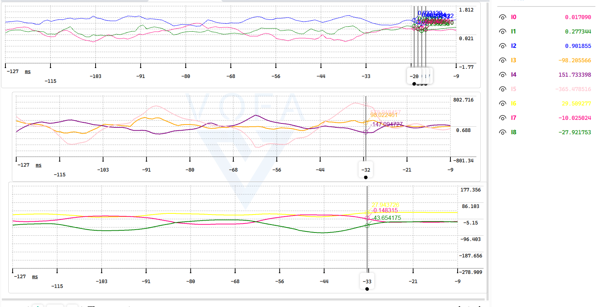

# 维特智能WT系列陀螺仪 & VOFA上位机可视化

本示例以**维特智能 WT61 六轴陀螺仪**为例，获取并可视化 **【加速度、角速度、姿态角】**

可为机器人测试分析提供数据可视化

VOFA 官方网站：https://www.vofa.plus/

维特智能官方网站：http://www.wit-motion.cn/

**使用说明：**

1、下载对应陀螺仪产品资料，阅读说明文档及代码示例；学习VOFA的基本使用

2、确保系统安装串口驱动

3、连接陀螺仪、启动VOFA

4、根据实际情况使用本示例或修改后使用
